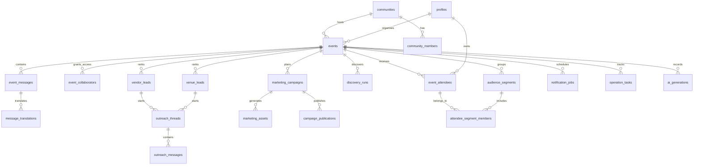

# Gatherly Supabase Schema Design

This schema supports the MVP frontend and the PRD workflows: public discovery, organiser workspace, venue/vendor operations, attendee reminders, marketing studio, AI generation records, translation, and community chat.

## Design Goals

- Keep public discovery fast and simple with published events readable by anonymous users.
- Keep organiser operations private through event ownership and collaborator checks.
- Support guest RSVP while still allowing authenticated attendee ownership later.
- Store AI outputs as durable records so generated plans, translations, prompts, and campaign assets can be reviewed, approved, reused, and audited.
- Seed realistic demo data without requiring live users in `auth.users`.

## Core Tables

| Area | Tables | Purpose |
| --- | --- | --- |
| Identity and communities | `profiles`, `communities`, `community_members` | User profiles, community pages, and membership. |
| Events | `events`, `event_collaborators`, `operation_tasks` | Public event records, organiser access, and operational timeline tasks. |
| Attendees | `event_attendees`, `audience_segments`, `attendee_segment_members`, `notification_jobs` | RSVP records, mailing-list segmentation, reminder drafts, scheduled sends, and simulated sending. |
| Community | `event_messages`, `message_translations` | Event chat, announcements, AI summaries, and translated message variants. |
| Leads and outreach | `venue_leads`, `vendor_leads`, `discovery_runs`, `outreach_threads`, `outreach_messages` | Exa/seed/manual lead discovery, fit ranking, outreach drafts, and simulated replies. |
| Marketing | `marketing_campaigns`, `marketing_assets`, `campaign_publications` | Campaign plans, image/video prompts, generated assets, captions, ad copy, and publishing/export state. |
| AI audit trail | `ai_generations` | Provider/model inputs and outputs for planning, translation, marketing, ranking, and drafting workflows. |

## Relationship Map

## RLS Model

| Access Pattern | Policy Approach |
| --- | --- |
| Public event browsing | Anonymous and authenticated users can read `events` where `status = 'published'` and `visibility` is public or unlisted. |
| Guest RSVP | Anonymous and authenticated users can insert into `event_attendees` only for published public events. |
| Organiser workspace | Private tables are readable and writable only when the current user is the event owner or an active collaborator. |
| Attendee privacy | Authenticated users can read/update their own attendee row; organisers can manage attendees for their events. |
| Community chat | Published event messages are readable publicly for the MVP preview; posting requires authenticated event participation. |
| AI and marketing outputs | Event-scoped AI, marketing, outreach, and publication records are restricted to event operators. |

Private RLS helper functions live in `app_private` rather than the exposed `public` schema:

- `app_private.is_event_operator(event_id)`
- `app_private.is_event_participant(event_id)`

## Seed Data

The initial migration seeds demo records for:

- Three published public events.
- One active operations workspace event.
- Four attendees with language/reminder status.
- Venue and vendor leads.
- Exa discovery run placeholders.
- Outreach threads and messages.
- A marketing campaign with prompt, caption, and video-direction assets.
- Reminder jobs.
- Community messages and translations.
- Operations timeline tasks.

## Future Additions

- Storage buckets for generated campaign images, uploaded media, and event documents.
- Edge Functions for OpenAI, Exa, Gemini/Veo, email, and ads provider adapters.
- Event analytics tables for RSVP conversion, email opens/clicks, and campaign performance.
- Sponsor lead and budget models.
- Feedback, post-event recap, and attendee matching tables.
